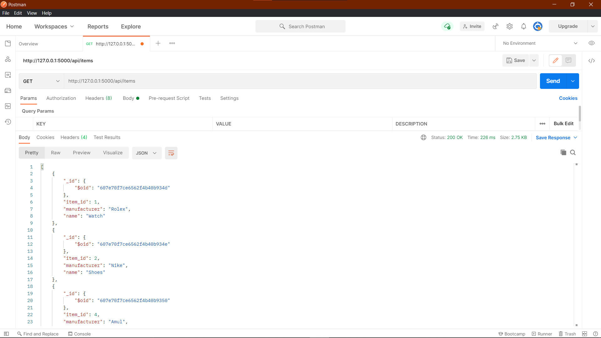
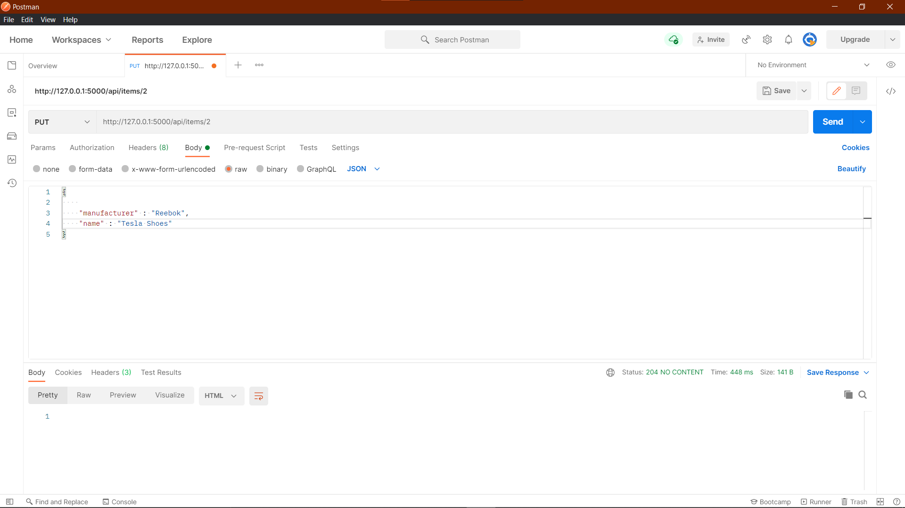
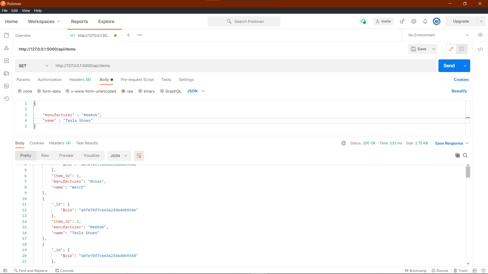
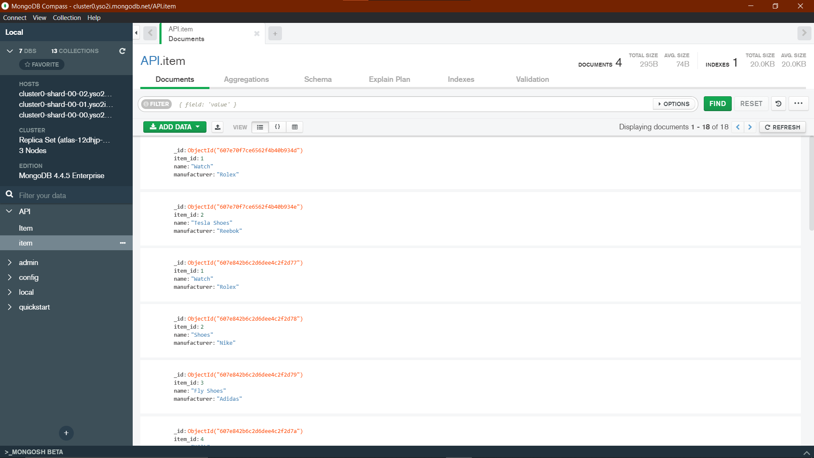

# Shopping_Cart_REST_API

## CRUD APP in Flask Restful with MongoDB Compass

- [ ] Instructions to get started 

Download zip file or clone the project
```
git clone https://github.com/Aniket29-shiv/Shopping_Cart_REST_API.git
```

Required modules
```
pip install flask
pip install flask-mongoengine (latest)
pip install flask-restful
```

- Install
- [x] Postman
- [x] MongoDB Compass
- [x] Put your MongoDB password in "api_constants.py" file

- To run the file
```
python api_mongo.py
```

- Following output appears in terminal
```
* Serving Flask app "api_mongo" (lazy loading)
 * Environment: production
   WARNING: This is a development server. Do not use it in a production deployment.
   Use a production WSGI server instead.
 * Debug mode: on
 * Restarting with stat
 * Debugger is active!
 * Debugger PIN: 595-401-104
 * Running on http://127.0.0.1:5000/ (Press CTRL+C to quit)
```

## Demo Screenshots

* Postman Interface




* MongoDB Compass Interface

